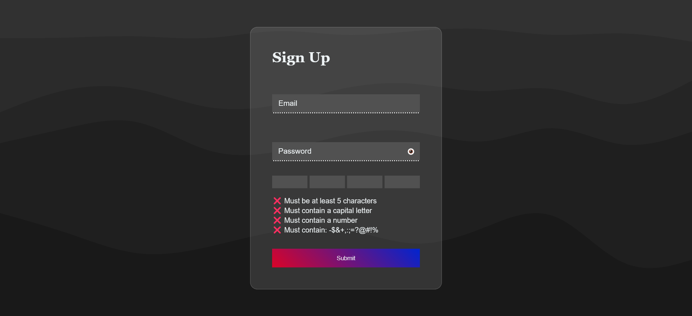
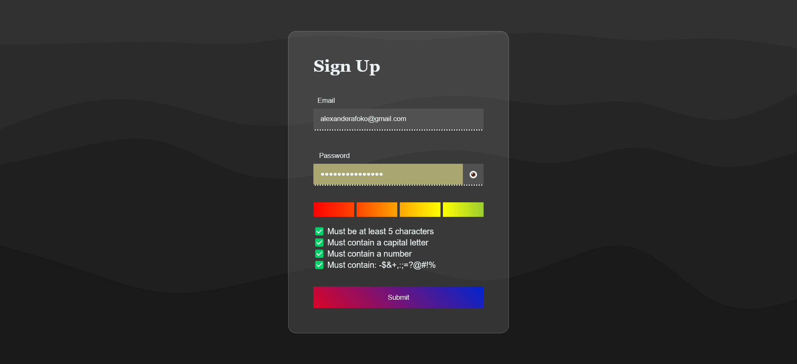

# React Signup Form 📜

A simple signup form built with React.js

## Features ✨

- **Password Strength Checker & Meter**: Real-time feedback on the strength of the chosen password based on 4 criteria:
   

  - is 5 or more characters long
  - contains a capital letter
  - contains a number
  - contains a special character(-$&+,:;=?@#!)

   

- **Mild Email Validation**: Basic validation to
  ensure the email format is correct.

- **Cool Design**: An attractive user interface inspired by a YouTube video from Fireship. [Check out the inspiration](https://www.youtube.com/watch?v=yrrw6KdGuxc&list=PPSV).

## Installation & Usage 🛠️

To get started with the React Signup Form, follow these steps:

1. Clone the repository using `git clone https://github.com/BeanyTheCoder/react-signup-form.git`.

2. Navigate to the project directory using `cd  react-signup-form`.
3. Install dependencies with `npm install`.
4. Run the app with `npm run dev`.

## Screenshots 📷

_Form image_

_Form filled image_

## Links 🔗

Live site link: [here](https://beanythecoder.github.io/react-todo-app/)

## Technologies Used 🛠️

- React.js
- HTML & CSS

## License 📝

This project is licensed under the [LICENSE](link-to-license-file).

## Acknowledgments 🙏

- Thanks to [Fireship](https://www.youtube.com/channel/UCsBjURrPoezykLs9EqgamOA) for inspiration for the design of the signup form.

- Thanks to [Haikei](https://app.haikei.app/) for the background image.

- I used [Glass css](https://css.glass/) for the glassmorphic card

## Contact 📧

For any questions or feedback, feel free to reach out to me at alexanderafoko@gmail.com.
